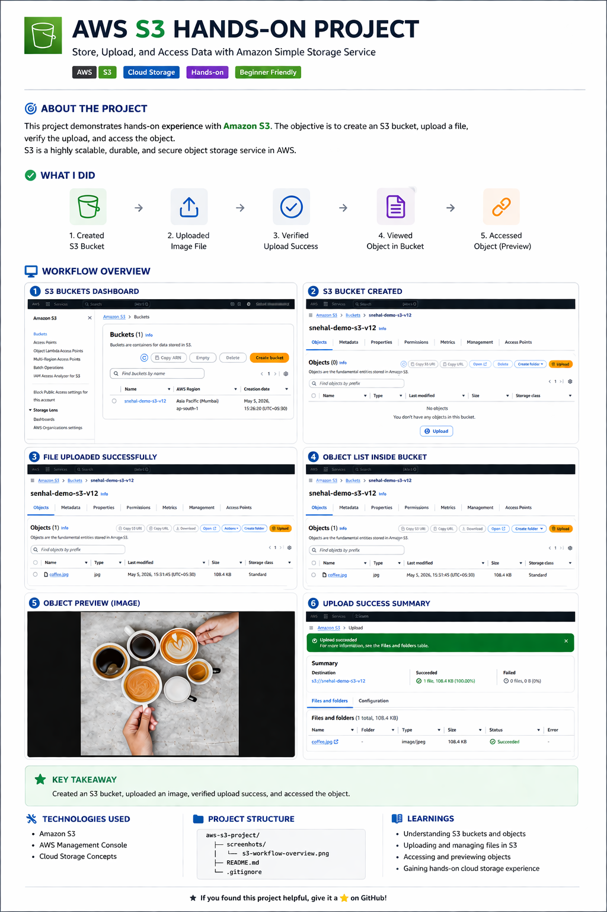

# 📦 Amazon S3 – Hands-on Implementation

## 📌 Overview

This project demonstrates practical implementation of **Amazon S3 (Simple Storage Service)** for object storage. It covers bucket creation, file upload, and object access using the AWS Management Console.

---

## 🎯 Objectives

- Create and configure an S3 bucket
- Upload and manage objects
- Understand basic storage concepts in AWS
- Verify object access via URL

---

## 🛠️ Services Used

- Amazon S3

---

## 📂 Project Workflow

1. Created an S3 bucket in the Mumbai region (`ap-south-1`)
2. Configured default settings and permissions
3. Uploaded an image file to the bucket
4. Verified successful upload
5. Accessed the object using its URL

---

## 🖼️ Implementation Screenshot

---

## 🔑 Key Takeaways

- Amazon S3 provides highly scalable and durable object storage
- Buckets are region-specific and globally unique
- Objects can be accessed via URLs (based on permissions)
- Simple UI makes file upload and management easy

---

## 📎 Notes

- Sensitive information (Account ID, credentials) has been blurred for security
- This project focuses on basic S3 operations using the AWS Console

---

## 🚀 Future Enhancements

- Enable static website hosting using S3
- Configure bucket policies and IAM roles
- Implement lifecycle rules for cost optimization
- Integrate with CloudFront for content delivery

---

## 👩‍💻 Author

Snehal Narale
B.E. IT Student | AWS & Cloud Learner
